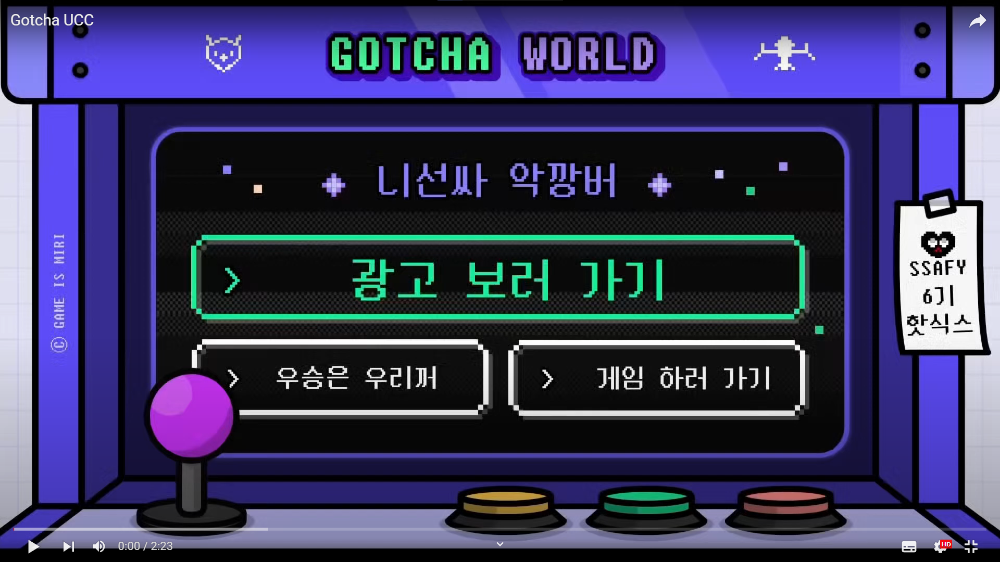

# 딱걸렸쥬?! - Gotcha🕹

# 🎮 서비스 소개

## 딱 걸렸쥬?(GotCha)

- 소개 : 감정표현을 잘 숨기지 못하는 사람들을 위한 **웹 화상 게임** 서비스
- 서비스 명 : **딱걸렸쥬(GotCha)**

### 타겟

- 포커페이스 유지를 잘 못하는 사람
- 색다른 심리게임을 찾는 사람

### 팀원 소개

---

👨‍💻 **유우식** - 팀장, FE

👩‍💻 **안예지** - FE, ,BE

👨‍💻 **안현호** - BE, DevOps

👩‍💻 **이예나** - FE, ,BE

👩‍💻 **최유미** - FE, ,BE

👨‍💻 **김두회** - FE

## 1) 서비스 설명

심리게임에서 얼굴표정은 매우 중요합니다. 그런데 혹시, 본인이 너무 좋은 패나 안좋은 패를 받았을 때 표정을 숨기지 못해 금방 패배한 경험이 있으시진 않은가요?
딱 걸렸쥬?(GotCha)는 이런 분들을 위해서 표정 분석 api를 이용하여 포커페이스를 도와주어 초심자들도 쉽게 즐길 수 있는 도둑잡기 게임 플랫폼입니다.
WebRTC의 실시간 화상, 음성 소통의 이점을 활용하여 상대의 비언어적 표현을 빠르게 캐치하고 서로 의사소통하며 더욱 많은 재미를 느낄 수 있습니다

> **효과**
> 
- 포커페이스 유지
- 아이스 브레이킹 효과
- 온라인에서 진행으로 시공간의 제약에서 벗어남

## 2) 프로젝트 개요

- 진행기간 : 2022.01.10 ~ 2022.02.18
- 목표
    - 플레이어는 음성, 카메라 영상을 통해 서로 소통할 수 있으며, 도둑잡기 카드게임을 온라인으로 즐길 수 있습니다.
    - 웹 브라우저로 어플리케이션 설치 없이 이용할 수 있습니다.
    - 비공개방을 만들어 친구들과 플레이하거나, 공개방을 만들어 모르는 사람과 같이 게임을 즐길 수 있습니다.
    - 독특한 잼민이의 표정분석 멘트로 재밌고 유쾌한 게임을 즐길 수 있습니다.
    

## 3) 게임 규칙

- 인원 수에 따른 카드 분배
    - **최소 2인** 이상 플레이 가능
    - 인원 수 대로 카드 53장을 나누어 분배
    - 분배된 카드에서 **색깔 상관없이 숫자, 글자가 같은 카드의 갯수가 짝수이면 카드 제거**
    - 남은 카드로 게임 진행 시작
- 매 턴마다 상대방의 카드를 한 장씩 가져오기
    - 상대방의 카드를 가져온 뒤 **카드 덱 셔플** (가져온 카드의 위치 기억 방지)
    - 카드 선택 전 무슨 카드를 가져올지 고민하는 단계에서 상대방이 고른 카드 빨간색으로 강조
- 승리 조건
    - 매 턴 카드를 주고받으면서 중복된 카드를 버리고 현재 카드의 갯수가 0이 되면 승리 후 게임 참여 불가
    - 남은 사람들끼리 게임 진행 후 최종적으로 조커카드를 가지고 있는사람이 도둑이 되어 패배
    

## 4) UCC

# ⚙️ Tech Stack

### 1) Architecture

### 2) Tech Stack

- **Frontend**
    - Framework
        - Vue `2.6.14`
        - Vuex `3.4.0`
        - Vue-router `3.2.0`
        - bootstrap `4.6.1`
        - bootstrap-vue `2.21.2`
    - WebRTC
        - OpenVidu `2.20.0`
    - WebSocket
        - SockJS-client `1.5.2`
        - webstomp-client `1.2.6`
    - API
        - Face API `0.22.2`
- **Backend**
    - Framework
        - SpringBoot `2.6.3`
    - Database
        - MySQL (Docker container) `5.7.35`
        - JPA `2.6.1`
        - Hibernate `5.6.4`
    - WebSocket
        - Spring WebSocket (SockJS, stomp) `5.3.15`
    - etc.
        - Spring Security `5.6.1`
        - JWT `0.9.1`
        - Swagger `2.9.1`
        - lombok `1.18.20`
        - Gson `2.8.5`
- **Release**
    - AWS `GNU/Linux 5.4.0.1018-aws`
    - Docker `20.10.12`
    - NginX `1.18.0`
- **IDE**
    - STS `3.9.14`
    - Visual Studio Code `1.64.2`

### 3) 외부 서비스 정보

- **OpenVidu** : **미디어 서버**
  
    
    
    OpenVidu는 웹 또는 모바일 애플리케이션에서 화상 통화를 쉽게 추가할 수 있는 플랫폼입니다. 애플리케이션에 매우 쉽게 통합할 수 있는 완전한 기술 스택을 제공합니다. WebRTC를 구현하기 위해 사용했습니다.
    
- **Face API** : **표정 분석 API**
  
    
    
    Face API는 Tensorflow.js core 위에 구현된 브라우저 및 Node.js용 JavaScript 얼굴 인식 API입니다. 저희 게임에서는 유저의 표정을 분석하여 포커페이스를 유지하는데 도움을 주도록 사용했습니다.
    

# 📋 주요 기능

- **메인화면**
  
    
    
- **룸리스트**
  
    
    
- **방 만들기**
  
    
    
- **게임방 유저 입장**
  
    
    
- **게임 시작 - 호스트만 시작하기 버튼 눌러서 게임 시작 가능**
  
    
    
- **게임 도움말- 좌측 상단 물음표 버튼 클릭**
  
    
    
- **본인이 picker일 때(카드를 고르는 사람)**
    - 카메라 **빨간색 테두리** 효과
    - 클릭한 카드 **빨간색 테두리** 효과
    - 가져올 카드 클릭 후 카드 선택 버튼
    - 30초 타임 아웃 직후 - 카드 자동 선택 후 순서 변경
    
    
    
- **본인이 picked일 때(picker가 카드를 고르는 대상)**
    - picked의 표정 분석-(잼민이 멘트 변화)
    
    
    
- **탈출자 발생**
  
    
    
- **본인 탈출**
  
    
    
- **게임 끝 게임 종료 화면**
  
    
    
- **방나가기→ 룸리스트로 이동**
  
    
    
- **세션으로 돌아가기 → 게임방으로 재이동**
  
    
